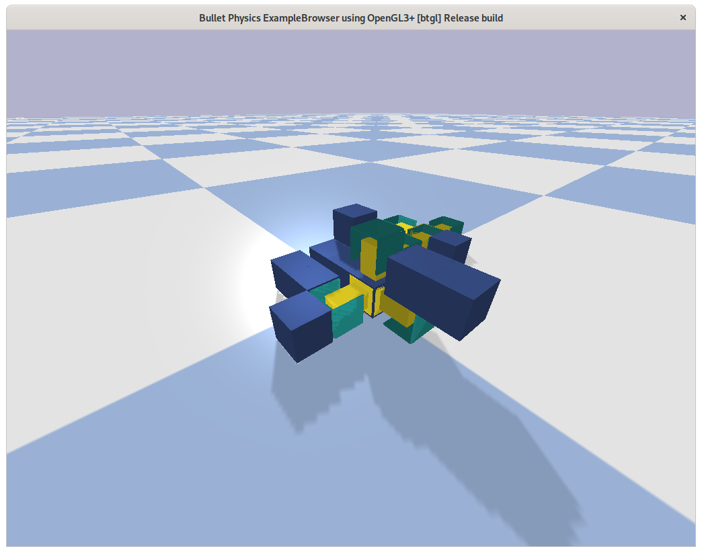

# Robotics, Evolution and Modularity (`REM`)
This package implement a modular robotics environment for
[`openai-gym`](https://gym.openai.com/).



## Example
```python
# Import OpenAI Gym
import gym
# Import this package to get access to our environments
import gym_rem
# Import numpy to generate input for robot
import numpy as np

# Create environment for modular locomotion. The goal is to move as far as
# possible for 20 seconds
env = gym.make("ModularLocomotion3D-v0")
# To enable GUI rendering call 'render' once before 'reset'
env.render()
# Then we need to create our modular robot!
# The following creates a single servo
robot = gym_rem.morph.three.Servo()
# We can easily add modules to this servo
robot += gym_rem.morph.three.Servo()
# Once we are done building the robot we spawn it into the environment through
# the reset functionality
#
# NOTE: It is important to use 'morphology=robot' or else OpenAI Gym will
# complain
env.reset(morphology=robot)
# Then we enter the regular old gym loop
while True:
    # In this example we pass an input consisting of no actions taken
    env.step(np.zeros(len(robot)))
    # Call 'render' to have the GUI updated
    env.render()
```

## Install
Download the package and use `pip install`, we highly recommend you also create
a [`virtualenv`](https://virtualenv.pypa.io/en/stable/).

```bash
$ cd /path/to/gym_rem
$ pip install -U -e .
```

## Tools
In the [examples](./examples) folder you can find some useful tools to checkout
both performance and inspect individuals. The
[`benchmark`](./examples/benchmark.py) example can be run to estimate
performance of this package in your compute environment. With the
[`inspect`](./examples/inspect.py) example you can load and inspect morphologies
stored using [`pickle`](https://docs.python.org/3/library/pickle.html).
